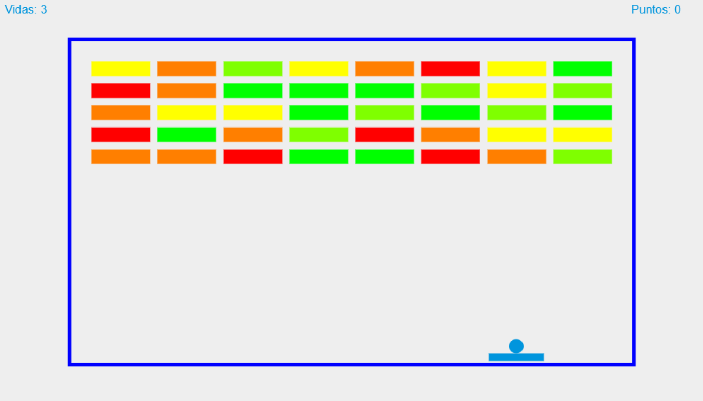

# Arkanoid Game

Este es un proyecto del juego Arkanoid, un clásico juego de romper ladrillos. El objetivo del juego es destruir todos los ladrillos en la pantalla utilizando una bola que rebota y una paleta controlada por el jugador.

## Estructura del Proyecto

El proyecto tiene la siguiente estructura de archivos:

```
arkanoid-project
├── index.html         # Página principal del juego
├── src
│   ├── arkanoid.js    # Punto de entrada del juego
│   ├── ball.js        # Clase que representa la bola
│   ├── paddle.js      # Clase que representa la paleta
│   └── brick.js       # Clase que representa los ladrillos
├── styles.css         # Estilos CSS para el juego
└── README.md          # Documentación del proyecto
```

## Instrucciones para Jugar

1. Abre el archivo `index.html` en tu navegador.
2. Usa las teclas de flecha izquierda y derecha para mover la paleta.
3. Intenta romper todos los ladrillos sin dejar que la bola caiga.

## Instalación y Ejecución

No se requiere instalación adicional. Simplemente descarga el proyecto y abre `index.html` en tu navegador.

## Detalles del Código

- `arkanoid-project/src/arkanoid.js`: Inicializa el juego y gestiona el bucle principal.
- `arkanoid-project/src/ball.js`: Define la lógica y el comportamiento de la bola.
- `arkanoid-project/src/paddle.js`: Controla la paleta del jugador.
- `arkanoid-project/src/brick.js`: Maneja la creación y el estado de los ladrillos.
- `arkanoid-project/src/audio.js`: Gestiona los efectos de sonido del juego.

## Propósito Educativo

Este proyecto ha sido creado con la intención de formar a niños de colegios e institutos en JavaScript. A través del desarrollo y la modificación de este juego, los estudiantes pueden aprender conceptos fundamentales de programación, como la manipulación del DOM, el manejo de eventos y la lógica de juego.

## Dedicado a

Este proyecto está dedicado a mis sobrinos Dani, Luci, Rubén y Jorge.

## Licencia

Este proyecto está licenciado bajo la Licencia Pública General de GNU versión 3. Puedes encontrar más detalles en los archivos [LICENSE](LICENSE) y [LICENSE_ES](LICENSE_ES).

## Captura de Pantalla



¡Diviértete jugando!